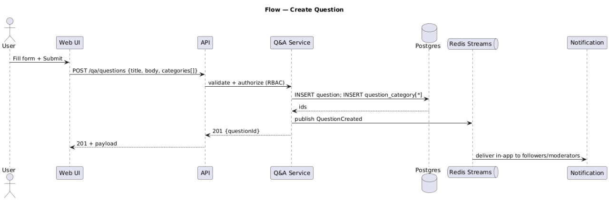
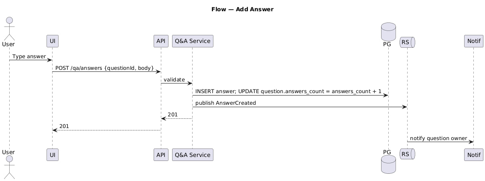
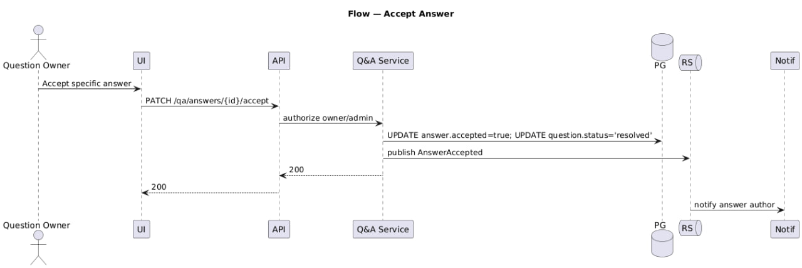
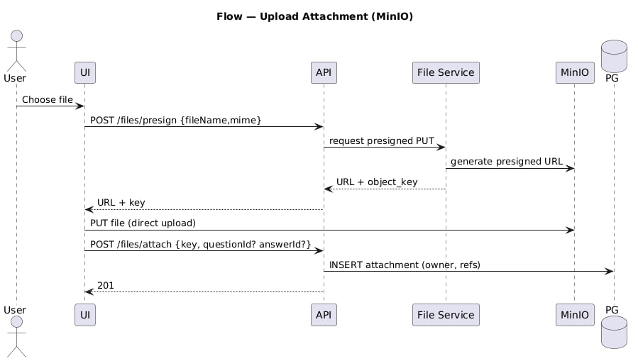
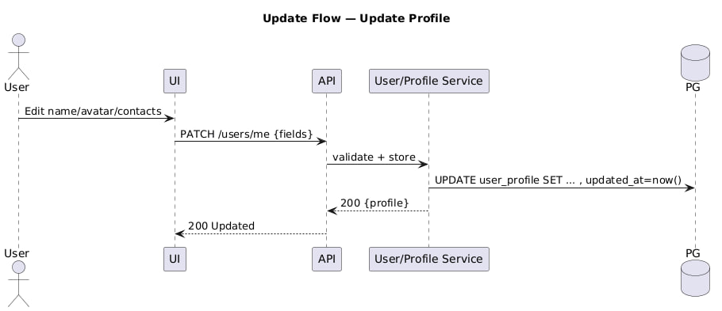
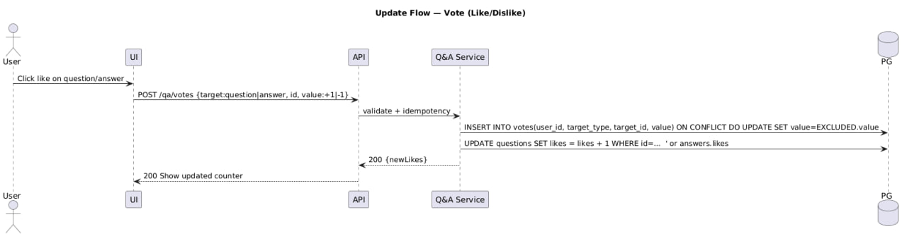
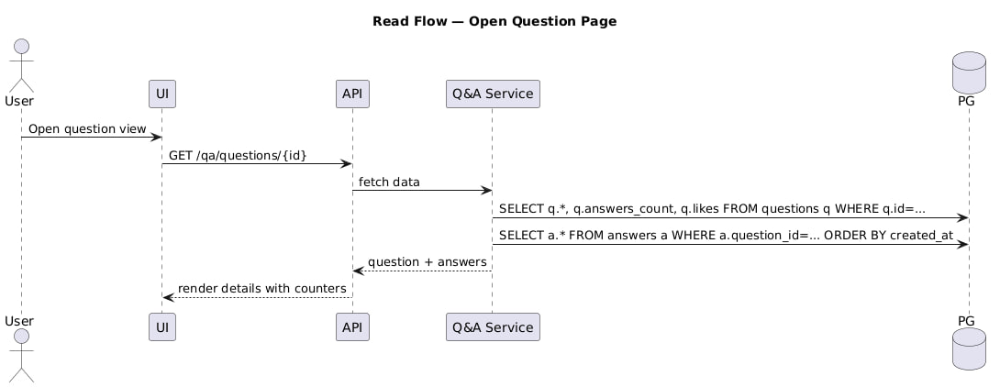
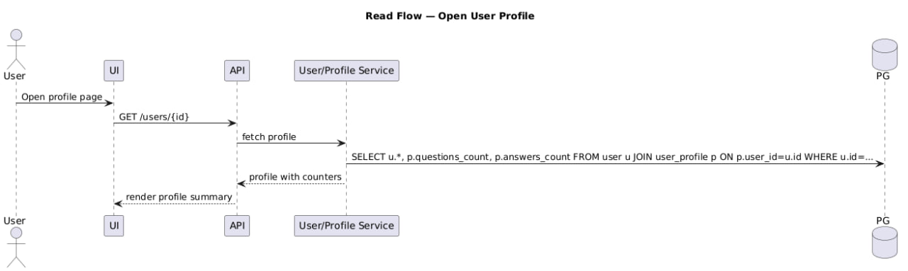
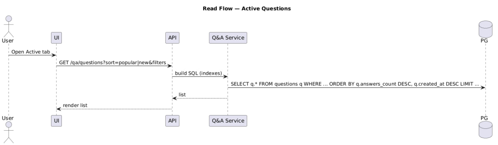
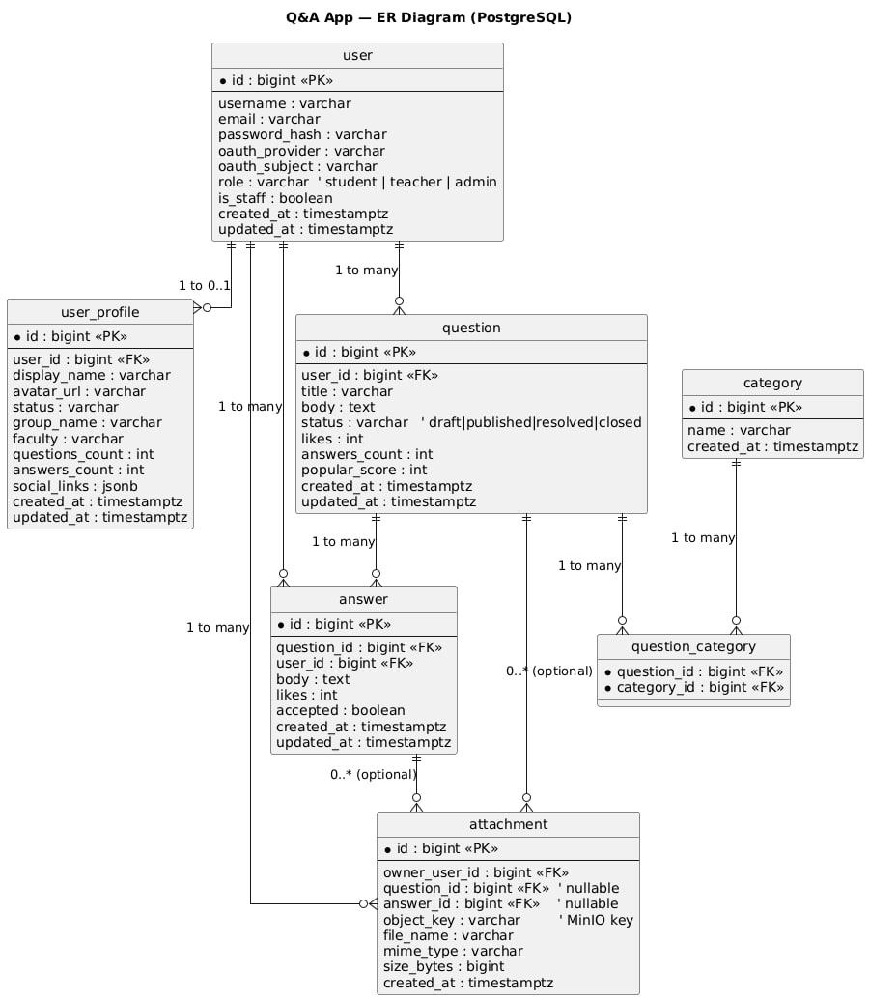

# NODA

## Ідея

Ми створюємо Q&A-платформу **[NODA]** (аналог StackOverflow/Quora), орієнтовану на студентів та початківців-розробників.

Ключові можливості:

- створення запитань та відповідей;
- пошук по темах;
- додавання тегів;
- лайки та репости;
- прийняття найкращої відповіді;
- редагування власних постів;
- профіль користувача з аватаркою та описом;
- сейви (збереження обраних постів);
- підписка на теги;
- система ролей і верифікації (студент → підтверджений користувач → модератор).

---

## Технологічний стек

### Backend

- **Node.js 20 LTS + TypeScript (ESM, NodeNext)**
- **NestJS 10+** — модульна архітектура, DI, Guards, Pipes, Interceptors
- **Prisma ORM**
- **PostgreSQL** — основна база даних
- **Redis** — кеш, черги, токени
- **Meilisearch** — пошук (з можливістю міграції на Elasticsearch)
- **JWT + Passport.js** — автентифікація
- **BullMQ (Redis)** — фонові завдання
- **Socket.IO** — реальний час (нотифікації)
- **S3-сумісне сховище** (MinIO / AWS S3) — файли та аватарки
- **Swagger** — документація API
- **pino** — логування
- **nestjs-i18n** — локалізація відповідей та помилок

---

### Frontend

- **Next.js 14+ (App Router)**
- **React 18 + TypeScript**
- **TailwindCSS** — стилізація
- **Zustand / Redux Toolkit** — state management
- **React Query (TanStack)** — робота з API
- **next-i18next** — багатомовність інтерфейсу
- **MDX / Markdown renderer** — форматування відповідей

---

### Інфраструктура

- **Docker + docker-compose**
- **NGINX** — реверс-проксі, HTTPS
- **CI/CD**: GitHub Actions
- **Хостинг**: Railway (MVP) або VPS (Hetzner, DigitalOcean)
- **Prometheus + Grafana** (опційно) — моніторинг
- **pgBackRest / pg_dump** — бекапи PostgreSQL
- **Meilisearch dumps** — бекапи пошуку

---

## Команда

- ІО-35 Степанов Олександр **[TEAM LEAD]** – [**[pliffdax]**](https://github.com/pliffdax)
- ІО-36 Варшавський Тимур – [**[varshavskiy05]**](https://github.com/varshavskiy05)
- ІО-36 Плешу Андрій – [**[Ripper-del]**](https://github.com/Ripper-del)
- ІО-36 Карлик Максим – [**[ypichev]**](https://github.com/ypichev)

## LAB2

- ІО-36 Варшавський Тимур
- Створення питання:
- 

---

- Відповідь на питання:
- 

---

- Прийняття питання:
- 

---

- Завантаження вкладень:
- 

---

- Повідомлення:
- 

---

- ІО-36 Карлик Максим

---

- Оновлення профілю:
- 

---

- Голосування:
- 

---

- Аггрегація при перегляді питання:
- 

---

- Аггрегація для профілю користувача:
- 

---

- Вибірка «активних питань»:
- 

---

- ІО-35 Степанов Олександр Олександрович

---

- ER Модель:
- 
